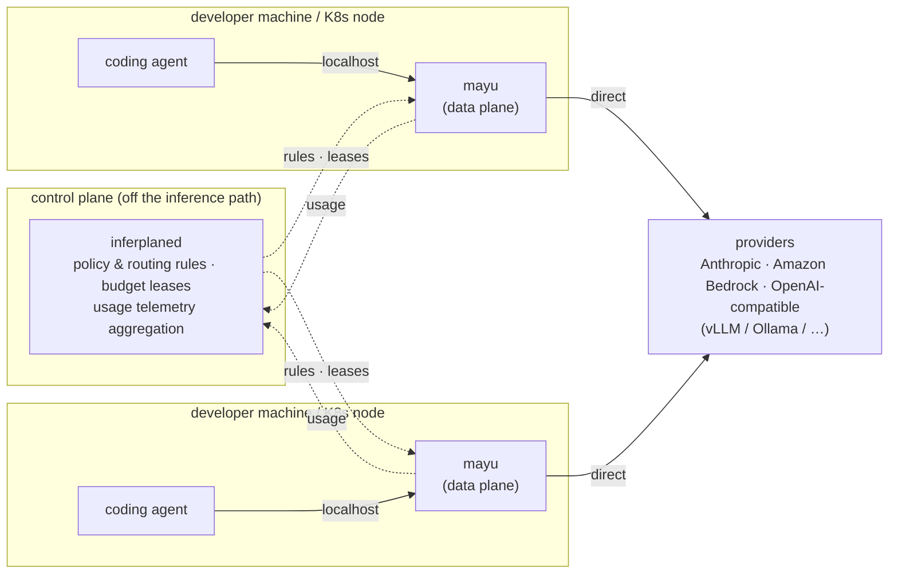

# inferplane

[](LICENSE)
[](go.mod)
[](#status)

**inferplane** — a control plane for LLM consumption governance.
Policy and budget are distributed from the center; **`mayu`**, the
node-local data plane, enforces them without sitting in anyone's critical path.

`mayu` is a component name, not a project name — it holds the same position in
inferplane that ztunnel/waypoint hold in Istio. It runs on localhost or on each
Kubernetes node, speaks your coding agent's native protocol (Anthropic Messages,
OpenAI Chat Completions, Bedrock InvokeModel), and enforces the rules the control
plane (`inferplaned`) hands it: per-user attribution, budget cutoffs, and model
routing.

## Goals

1. Give Claude Code, OpenCode, and Codex[^codex] users a single entry point
   to Anthropic, Amazon Bedrock, and OpenAI-compatible (vLLM/Ollama/etc.)
   providers.

[^codex]: Codex support is a goal, not yet a verified capability — no
   Codex-specific code, fixture, or test exists in the tree; see the
   Purpose alignment table in `docs/roadmap.md`.
2. Let each user choose which model they talk to.
3. Support cost-driven model substitution — swap to a cheaper model (e.g.
   Sonnet → GLM) when cost, not just capability, decides.
4. Set spend limits per team and per individual, block on breach, and always
   show how much has been spent.
5. Keep the control plane off the inference path, so a control-plane outage
   never stops request traffic (no SPOF).

Goal 5 pulls against making goal 4 accurate under horizontal scale — see
[Current limits](#current-limits) below and `docs/roadmap.md`.

## Target users

Enterprise platform/SRE teams governing coding-assistant LLM traffic across
many developers and teams. The on-ramp stays bottom-up — a single team can
run `mayu` standalone in minutes with no control plane (see [Quick
start](#quick-start--mayu-standalone)) — but the intended growth path is a
platform team adopting `inferplaned` to govern that traffic fleet-wide once
more than one team is on it.

## Non-goals

- **Not an MCP gateway.** Routing MCP traffic is already well served by
  Envoy AI Gateway / Higress; that's not where inferplane differentiates.
- **Not competing on data-plane inference performance.** The core is
  governance — attribution, budget, audit — not inference optimization.
- **No embeddings, image, audio, or rerank support in v1.** Chat/completions
  traffic only until that lane is proven (see `docs/roadmap.md`).

## Current limits

**Single-replica `mayu` only, today.** `internal/keystore` is SQLite-only and
`internal/limiter`/`internal/budget` are in-memory — running more than one
`mayu` replica lets each enforce its own copy of every counter, so rate,
token quota, and (in standalone mode) budget ceilings can each reach up to
N× the configured value, and key resolution splits across replicas
(ADR-013, design-only, not yet implemented). Budget is only *partially*
better: when a control plane is attached, ADR-034's lease pattern bounds
team-level overspend across data planes (worst case is the sum of
outstanding grants, not exact) — but per-key budgets and standalone `mayu`
get no lease at all. Making rate/quota equally accurate, and closing budget's
remaining gaps, is the tracked next step — see `docs/roadmap.md`.

**Goals 3 and 4 are partially unenforced today.** Per-user *model choice*
(goal 2) is enforced. Per-user *budget/rate* and policy-driven cost
substitution (goal 3, routing rules) are not yet — see the purpose-alignment
table in `docs/roadmap.md` for exact status and code references.

## Why not a central gateway?

Every "LLM gateway" puts a shared hop on the inference path. inferplane exists
because that is the wrong place to stand:

1. **Streaming latency.** Agent traffic is server-sent events; a central hop
   taxes *every chunk* of *every response* and lands directly on time-to-first-
   token. This is measurable — benchmark a proxied vs. direct stream and the
   cost of the extra hop is visible on day one, before any queueing under load.
2. **Fault isolation.** When a central gateway degrades, every developer and
   every agent stops at once. A node-local data plane keeps enforcement running
   through a control-plane outage: rules and budget leases already on the node
   keep working (fail-open within lease validity; only hard budget caps fail
   closed when their lease expires — per-rule `failurePolicy`, never global).

The control plane never carries inference traffic. It distributes policy,
issues budget leases, and aggregates usage telemetry — all off the request
path. Short-lived credential brokering is on the roadmap (see [Status](#status)).

## Architecture



- **`inferplaned`** (control plane) — distributes versioned policy
  ([`api/v1alpha1`](api/v1alpha1/): CRD-style schema, delivered over
  inferplane's own HTTP channel — no Kubernetes required) and issues budget
  leases; each data plane heartbeat carries the policy pull, consumption
  report, lease renewal, and version-skew rejections in one round trip.
  Settled usage is pushed up separately into queryable windows. Short-lived
  credential brokering is not yet implemented (see [Status](#status)).
- **`mayu`** (data plane) — the full gateway: model→provider routing with
  fallback and circuit breakers, Anthropic⇄OpenAI schema translation,
  cache-safe verbatim forwarding, virtual keys with team RBAC, two-phase
  quota/budget enforcement, tamper-evident audit logging, Prometheus/OTel
  GenAI metrics. *Works standalone today* (see Quick start).

Budget control uses a **lease pattern**: N proxies each see only their own
usage, so the control plane grants each `mayu` a slice of budget ("this much,
for this interval") that it enforces locally with zero network round trips,
reporting consumption and renewing asynchronously.

## What it governs

- **Per-user token attribution** — who spent what, per user/team/model, at
  integer micro-USD precision; identity fixed at credential issuance (OIDC).
- **Budget enforcement** — two-phase (pre-check before billing, settle after),
  team and per-key budgets/quotas, `block` or `warn`, hard caps that stay hard
  even when the control plane is down.
- **Model-tier routing** — route by model to the right provider/region tier
  (e.g. Opus for design work, Haiku for hooks and summaries), with priority
  fallback and per-provider circuit breakers, plus model-level fallback for a
  hardcoded client requesting a model the operator hasn't configured yet.
- **Credential lifetime** — in standalone mode, provider keys are referenced
  from local `env:`/`file:` secret refs, never inline in config. Short-lived
  credential brokering from the control plane is planned, not yet built.
- **Audit** — a tamper-evident hash-chain of every request, with chargeback
  reporting (`mayu report`).

## Quick start — `mayu` standalone

`mayu` runs without a control plane: local config only, full gateway feature
set. This is the supported first-touch path — you do not need to deploy
`inferplaned` to try inferplane.

```bash
git clone https://github.com/inferplane/inferplane.git
cd inferplane

# 1. Build the static binary (pure Go, CGO off)
CGO_ENABLED=0 go build -trimpath -o bin/mayu ./cmd/mayu

# 2. Run against the example config (Anthropic direct; secrets via env refs only)
export ANTHROPIC_API_KEY=sk-ant-...
export INFERPLANE_ADMIN_TOKEN=admin-secret
bin/mayu serve --config examples/config.json

# 3. Issue a virtual key (plaintext ik_... is shown once, never recoverable)
bin/mayu keys create --team demo --models '*' --store keys.db

# 4. Point your coding agent at it
export ANTHROPIC_BASE_URL=http://localhost:8080
export ANTHROPIC_API_KEY=ik_...
claude
```

Governance rules live in CRD-style `GovernancePolicy` YAML — the same
documents the control plane will distribute, applied locally today: add
`"policies": ["examples/policies/"]` to the config and edit the YAML
(per-team/per-user model allow-lists, budgets in milliUSD, rate limits — see
[`examples/policies/demo.yaml`](examples/policies/demo.yaml)). Files are
watched: **save a change and it applies within ~2 seconds**, no restart.

Port `8080` is the data plane; `9090` is the admin plane (`/healthz`,
`/metrics`, key-management API, and the web console at
`http://localhost:9090/admin/ui/`). For a self-hosted-only setup (vLLM/Ollama,
no cloud key) start from
[`examples/config.selfhosted.json`](examples/config.selfhosted.json); for
Docker and Kubernetes (Helm chart in [`charts/inferplane`](charts/inferplane/)),
config hot-reload, OIDC SSO, and `mayu login` short-lived keys, see
[docs/onboarding.md](docs/onboarding.md).

## Status

**Alpha. APIs and config schema are unstable and will change without notice.**

| Component | State |
|---|---|
| `mayu` standalone (gateway, keys, RBAC, quotas/budgets, audit, console) | Working — the former inferplane gateway, moved intact |
| `inferplaned` control plane | Policy distribution + budget-lease ledger + usage telemetry working (ADR-034/036); credential brokering not yet implemented |
| `api/v1alpha1` policy schema + delivery channels | Working — same document via local file, control-plane push, Helm ConfigMap; CRD manifest for kubectl-native validation ([`deploy/crd/`](deploy/crd/)) |
| `inferplaned` policy store + console (ADR-038) | **Experimental, under review.** Opt-in Postgres store with a console Policies tab and `PUT`/`DELETE /v1alpha1/policies`; the write path has no per-rule-kind authorization tier or change audit yet — a superseding ADR is pending (see ADR-003 §Alternatives) |

The project targets CNCF Sandbox.

## Documentation

- [docs/architecture.md](docs/architecture.md) — component-level architecture
- [docs/onboarding.md](docs/onboarding.md) — Docker/Kubernetes deployment, SSO, CLI login
- [docs/reference/](docs/reference/INDEX.md) — per-layer implementation reference (API, data, security, infrastructure, agent/LLM)
- [docs/runbooks/](docs/runbooks/) — operational procedures
- [docs/decisions/](docs/decisions/) — design records (ADRs); start with
  [ADR-031](docs/decisions/ADR-031-monorepo-control-plane-data-plane-split.md),
  the control-plane/data-plane split
- [docs/roadmap.md](docs/roadmap.md) — open gaps vs. central-proxy gateways (global rate limits, durable ledger, self-update, embeddings)
- [CHANGELOG.md](CHANGELOG.md) · [GOVERNANCE.md](GOVERNANCE.md) · [MAINTAINERS.md](MAINTAINERS.md)

## Contributing

See [CONTRIBUTING.md](CONTRIBUTING.md). Every commit must be DCO signed off
(`git commit -s`). Security reports: [SECURITY.md](SECURITY.md).
License: [Apache-2.0](LICENSE).
