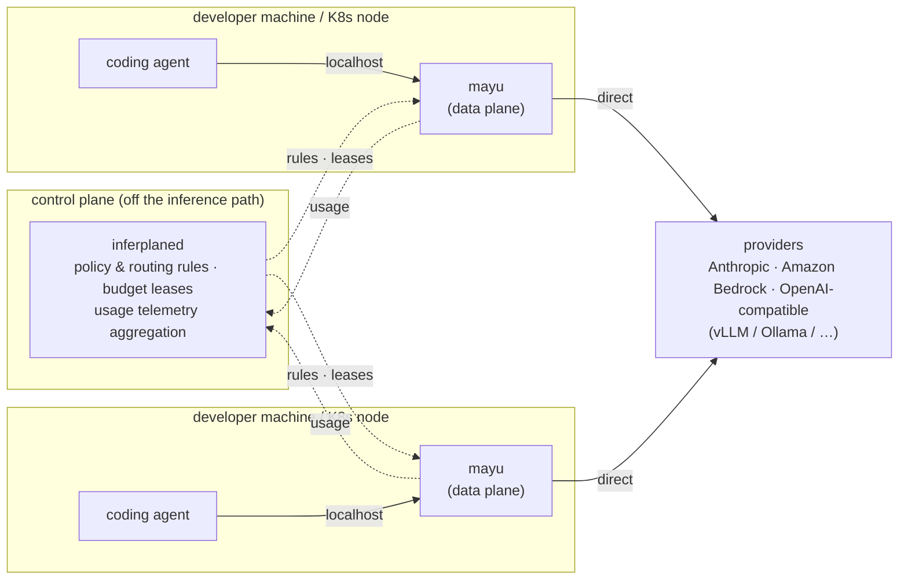

# inferplane

[](LICENSE)
[](go.mod)
[](#status)

**inferplane** — a control plane for LLM consumption governance.
Policy and budget are distributed from the center; **`mayu`**, the
data plane, enforces them under the selected deployment profile. The control-plane
HTTP service is not called for per-request policy/budget admission; shared
admission depends on Postgres. Broker credential renewal is a separate dependency.

`mayu` is a component name, not a project name — it holds the same position in
inferplane that ztunnel/waypoint hold in Istio. It runs on localhost or on each
Kubernetes node, speaks your coding agent's native protocol (Anthropic Messages,
OpenAI Chat Completions/Responses, Bedrock InvokeModel), and enforces the rules the control
plane (`inferplaned`) hands it: per-user attribution, budget cutoffs, and model
routing.

## Goals

1. Give Claude Code, OpenCode, and Codex[^codex] users a single entry point
   to Anthropic, Amazon Bedrock, and OpenAI-compatible (vLLM/Ollama/etc.)
   providers.
2. Let each user choose which model they talk to.
3. Support cost-driven model substitution — swap to a cheaper model (e.g.
   Sonnet → GLM) when cost, not just capability, decides.
4. Set spend limits per team and per individual, block on breach, and always
   show how much has been spent.
5. Keep control-plane HTTP off the inference path, with explicit outage limits:
   node-local authority is finite, shared admission requires Postgres, and
   readiness/staleness gates and hard-authority expiry still fail closed.

These are goals, not blanket completion or no-SPOF guarantees. See
[Deployment profiles](#deployment-profiles) and [Current limits](#current-limits).

[^codex]: Responses ingress and native/stateless adapters have local protocol
    tests and installed Codex CLI tool-round-trip tests, including Bedrock
    Converse. The [model-aware launcher](docs/codex-launcher.md) supplies model
    selection and context limits. Backend tool availability and native-only
    features remain explicit; see [Codex setup](docs/adaptive-routing.md).

## Target users

Enterprise platform/SRE teams governing coding-assistant LLM traffic across
many developers and teams. The on-ramp stays bottom-up — a single team can
run `mayu` standalone in minutes with no control plane (see [Quick
start](#quick-start--mayu-standalone)) — but the intended growth path is a
platform team adopting `inferplaned` to govern that traffic fleet-wide once
more than one team is on it.

## Non-goals

- **Not an MCP gateway.** Routing MCP traffic is already well served by
  Envoy AI Gateway / Higress; that's not where inferplane differentiates.
- **Not competing on data-plane inference performance.** The core is
  governance — attribution, budget, audit — not inference optimization.
- **No embeddings, image, audio, or rerank support in v1.** Chat/completions
  traffic only until that lane is proven (see `docs/roadmap.md`).

## Policy-aware routing

`GovernancePolicy.sensitiveData` selects approved internal destinations, complete
masking, or refusal before egress. Independent `routing.context` rules classify
weak/simple, optional normal, and strong/complex tasks. Context starts in **Shadow**;
explicit stability and **Enforce** support compatible multi-turn/tool workflows
and retain the actual successful model/provider between related requests.
Privacy always enforces, including during Shadow (ADR-043/044).

Strict budget tiers (`enforceTargets: true`) constrain every later selection and
retry after a switching threshold. A separate total hard cap remains binding.
The soft switching threshold does not become a smaller blocking admission cap.
Legacy optional tiers retain their behavior. Legacy ADR-043 two-class context
selection remains limited to eligible, completely inspectable single-user-turn
requests without history/tools/media/reasoning/structured output. ADR-044's
extended context/stability rules support compatible tool/history sessions; pins
are bounded and local to one gateway, not fleet-wide session state.

Start with [the operator guide](docs/policy-routing.md) and the isolated
[config](examples/config.policy-routing.json) /
[policy](examples/policy-routing/governance.yaml). Detectors are finite heuristics;
provider boundary labels and model capabilities are operator assertions. Unknown
content can fail closed, and existing transport limits still apply. Upgrade all
participating binaries and the CRD before activating new rules. For protection
before first control-plane sync, set `require_sync`; both count APIs remain local
HTTP 200 while unready. Evaluate task success, total cost including cold-cache
writes/retries, p95 latency, and privacy negative cases before Enforce. For the
combined three-class, PII, budget and Codex setup, use the
[adaptive guide](docs/adaptive-routing.md) and
[example configuration](examples/config.adaptive-routing.json). Local pins and
protocol tests do not establish measured savings or shared-state HA.

For global monetary budgets across node-local gateways, enable the
[durable budget profile](docs/durable-budgets.md) (ADR-045). Control-plane replicas
share a Postgres authority ledger; each gateway durably reserves a conservative
per-attempt bound locally before invoking a provider. Committed local grants
remain usable only while their deadlines and applicable readiness/staleness gates
permit admission; an outage cannot create or renew credit.

## Deployment profiles

| Profile | Selection/default | Implemented mechanism | Enterprise qualification |
|---|---|---|---|
| SQLite/local, including optional legacy CP (ADR-034) | Default standalone profile; legacy CP is opt-in | SQLite key/team records; local rate/quota/money counters. Legacy CP adds in-memory budget allowances, not ADR-045 durability. | Local enforcement only; replicas do not create a globally accurate shared gateway. Alpha. |
| Node-local monetary authority (ADR-045) | Opt-in durable CP authority and private node journal | Global **GovernancePolicy money** accounts in Postgres; per-attempt local reservations. Keys, rate/token quota and standalone/key-local money remain local. | Global policy-money mechanism implemented; fleet recovery/load and person-identity qualification remain open. Alpha. |
| Shared Postgres admission (ADR-046) | Opt-in Postgres key and governance stores; same authority database/schema | Shared key/team records and atomic RPM/TPM, token-quota and money reservations. Key lookup and admission synchronously access Postgres. | Requires qualified HA Postgres and gateway deployment; no disconnected admission guarantee. Alpha. |

All three profiles can opt into the implemented verified-identity registry through
`key_store.identity`; it is **not enabled by default**. Required mode binds
credentials to verified issuer/subject or server-derived service identity while
preserving registered account references. Optional attribution retains legacy
accounting. Shared records alone do not enable this protection. Six-role org/team
authorization, user-pool contracts and deployment qualification remain open;
user rate/token-quota policy rules still require ADR-046.

See [verified identity](docs/verified-identity.md) before activation: matching CP
declarations/required sync, trusted bindings for historical nonempty owners
(including revoked keys), and safe handling of empty-owner credentials are
mandatory. This is an opt-in mechanism, not an enterprise-ready checkmark.

| Profile | Control-plane HTTP loss while its DB remains reachable | Authority/shared Postgres loss |
|---|---|---|
| SQLite/local + optional legacy CP | Standalone has no CP requirement. Legacy CP behavior depends on installed policy, allowances and configured initial/stale gates; it is not unlimited outage authority. | No synchronous shared-admission DB dependency. A CP store outage can stop policy delivery; local SQLite/storage failure remains a separate risk. |
| ADR-045 | Already synchronized local credit may serve within readiness, policy-age and hard grant/window deadlines; no new grants while CP is unreachable. | Already issued local credit has the same finite limits; authority cannot replenish it without its DB. |
| ADR-046 | DB-backed admission may continue only with a valid installed policy/authority binding and applicable readiness/staleness gates. It does not call CP HTTP per inference. | New key resolution/admission fails closed; gateway replicas cannot replace the unavailable DB. |

`control_plane.require_sync` gates first policy delivery; `max_policy_age` can
stop admission after stale synchronization. ADR-045 requires initial authority
sync, and ADR-046 requires initial binding/readiness. Hard authority expiry and
exhaustion remain binding independently of policy-age settings. Count APIs retain
their local HTTP 200 contract while generation is refused. Individual gateway,
upstream and credential availability also matter: no profile establishes
unconditional no-SPOF operation.

See [durable budgets](docs/durable-budgets.md), [shared governance](docs/shared-governance.md)
and the [shared Helm example](examples/helm.shared-governance.yaml). Shared mode
rejects mutable SQLite provider topology; model/provider rollout remains explicit.

## Current limits

**Standalone and legacy budget counters are not durable.** In standalone mode they live only in
memory: restarting `mayu` mid-window resets every team, key, and user counter
to zero, even though the spend stays in the audit chain (`mayu report` still
shows it). With a control plane attached, a hard-cap lease fails *closed* only
once a lease has been received — if the control plane is unreachable at
`mayu` boot, each replica enforces its own local limit with no clamp until the
first heartbeat succeeds. Set `control_plane.require_sync: true` (optionally with
`max_policy_age`) to fail closed instead: governed requests 503 and `/readyz`
reports not-ready until a policy generation has arrived.
The opt-in ADR-045 profile requires initial sync, a private durable node journal,
and Postgres. It never falls back to these in-memory counters for global authority.

**Policy enforcement assumes the node operator is not the adversary.** `mayu`
proxies credentials that live on the node (`env:`/`file:` refs), so whoever
controls the node can call providers directly. ADR-040 brokering removes the need
for standing node Bedrock IAM credentials, but a compromised host can obtain its
broker token or vended sessions; it is not bypass-proof, and sessions are not yet
per-team scoped. Guardrails and region restrictions require correct provider/team
configuration; ADR-046 shares team records but does not make host credentials
unreadable. See `review/fable5/08-control-plane-bypass.md` for the threat boundary.

## Why not a central gateway?

The node-local profile separates the control-plane HTTP service from the
inference path. Its design goals differ from ADR-046's synchronous shared-DB
admission:

1. **Streaming latency.** Agent traffic is server-sent events; a central hop
   taxes *every chunk* of *every response* and lands directly on time-to-first-
   token. This is measurable — benchmark a proxied vs. direct stream and the
   cost of the extra hop is visible on day one, before any queueing under load.
2. **Fault isolation.** A node-local gateway can isolate inference from a
   control-plane-only outage while installed policy, readiness/staleness gates,
   credentials and any required local authority remain valid. This is bounded
   authorized operation, not a global fail-open policy. Shared ADR-046 admission
   instead depends on a reachable database.

The control plane never carries inference traffic. It distributes policy,
issues budget leases, and aggregates usage telemetry — all off the request
path. It also brokers short-lived Bedrock credentials on request (ADR-040, opt-in — see [Status](#status)).

## Architecture



- **`inferplaned`** (control plane) — distributes versioned policy
  ([`api/v1alpha1`](api/v1alpha1/): CRD-style schema, delivered over
  inferplane's own HTTP channel — no Kubernetes required) and issues budget
  leases; each data plane heartbeat carries the policy pull, consumption
  report, lease renewal, and version-skew rejections in one round trip.
  Settled usage is pushed up separately into queryable windows. With a broker
  role configured it also vends ≤1h STS Bedrock credentials so nodes need no
  Bedrock IAM of their own (ADR-040, opt-in — see [Status](#status)).
- **`mayu`** (data plane) — the full gateway: model→provider routing with
  fallback and circuit breakers, Anthropic⇄OpenAI schema translation,
  cache-safe verbatim forwarding, virtual keys with team RBAC, two-phase
  quota/budget enforcement, tamper-evident audit logging, Prometheus/OTel
  GenAI metrics. *Works standalone today* (see Quick start).

The diagram shows the node-local topology. ADR-045 grants finite budget
authority centrally and reserves it locally per attempt, reporting asynchronously.
ADR-046 instead resolves shared keys and reserves resources through synchronous
Postgres transactions. Legacy CP allowances are not a durable escrow ledger.

## What it governs

- **Per-user token attribution** — who spent what, per user/team/model, at
  integer micro-USD precision. Legacy mode retains owner attribution; opt-in
  required identity uses immutable registered account references and digest-only
  verified identity evidence. Historical bindings do not rewrite financial rows.
- **Budget enforcement** — two-phase (pre-check before billing, settle after),
  team and per-key budgets/quotas, `block` or `warn`, with the profile-specific
  scope and outage limits above. Expired/exhausted hard authority never becomes
  permission to send another request.
- **Model-tier routing** — route by model to the right provider/region tier
  (e.g. Opus for design work, Haiku for hooks and summaries), with priority
  fallback and per-provider circuit breakers, plus model-level fallback for a
  hardcoded client requesting a model the operator hasn't configured yet.
- **Credential lifetime** — in standalone mode, provider keys are referenced
  from local `env:`/`file:` secret refs, never inline in config. With a control
  plane, a bedrock provider can instead set `auth.mode: "broker"` and sign with
  broker-vended, cached ≤1h STS sessions (ADR-040), so it needs no standing
  Bedrock IAM credentials. Those sessions and the broker token remain sensitive
  node-accessible credentials; this does not protect against a compromised host.
  Initial broker acquisition fails boot/reload rather than falling back to the
  node's own AWS identity.
- **Audit** — a tamper-evident hash-chain of every request, with chargeback
  reporting (`mayu report`).

## Quick start — `mayu` standalone

`mayu` runs without a control plane in the SQLite/local profile; global authority
and shared admission require their explicit profiles. This is the supported
first-touch path — you do not need to deploy
`inferplaned` to try inferplane.

```bash
git clone https://github.com/inferplane/inferplane.git
cd inferplane

# 1. Build the static binary (pure Go, CGO off)
CGO_ENABLED=0 go build -trimpath -o bin/mayu ./cmd/mayu

# 2. Run against the example config (Anthropic direct; secrets via env refs only)
export ANTHROPIC_API_KEY=sk-ant-...
export INFERPLANE_ADMIN_TOKEN=admin-secret
bin/mayu serve --config examples/config.json

# 3. Issue a virtual key (plaintext ik_... is shown once, never recoverable)
bin/mayu keys create --team demo --models '*' --store keys.db

# 4. Point your coding agent at it
export ANTHROPIC_BASE_URL=http://localhost:8080
export ANTHROPIC_API_KEY=ik_...
claude
```

Governance rules live in CRD-style `GovernancePolicy` YAML — the same
documents the control plane will distribute, applied locally today: add
`"policies": ["examples/policies/"]` to the config and edit the YAML
(per-team/per-user model allow-lists, budgets in milliUSD, rate limits — see
[`examples/policies/demo.yaml`](examples/policies/demo.yaml)). Files are
watched: **save a change and it applies within ~2 seconds**, no restart.

Port `8080` is the data plane; `9090` is the admin plane (`/healthz`,
`/metrics`, key-management API, and the web console at
`http://localhost:9090/admin/ui/`). For a self-hosted-only setup (vLLM/Ollama,
no cloud key) start from
[`examples/config.selfhosted.json`](examples/config.selfhosted.json); for
Docker and Kubernetes (Helm chart in [`charts/inferplane`](charts/inferplane/)),
config hot-reload, OIDC SSO, and `mayu login` short-lived keys, see
[docs/onboarding.md](docs/onboarding.md).

## Status

**Alpha. APIs and config schema are unstable and will change without notice.**

| Component | State |
|---|---|
| `mayu` standalone (gateway, keys, RBAC, quotas/budgets, audit, console) | Working — the former inferplane gateway, moved intact |
| `inferplaned` control plane | Policy distribution + budget-lease ledger + usage telemetry + credential brokering working (ADR-034/036/040) |
| Short-lived credential brokering (ADR-040) | Working, opt-in. `inferplaned` vends ≤1h STS Bedrock sessions over `POST /v1alpha1/credentials` when `INFERPLANED_BROKER_ROLE_ARN` is set; `mayu`'s bedrock provider opts in with `auth.mode: "broker"`. Bedrock only (1P Anthropic has no temporary-token mechanism). **v1 limitations, by design:** one shared broker token with caller-chosen dataplane ids, so CloudTrail attribution is the id *claimed*, not the machine; brokered sessions carry unrestricted `bedrock:Invoke*` (per-team session policies are the v2). Bypass prevention is real only where mayu's environment is not readable by its users — on a developer-owned machine it removes the standing node IAM grant but not the bypass |
| `api/v1alpha1` policy schema + delivery channels | Working — same document via local file, control-plane push, Helm ConfigMap; CRD manifest for kubectl-native validation ([`deploy/crd/`](deploy/crd/)) |
| `inferplaned` policy store + console (ADR-038) | **Experimental, under review.** Opt-in Postgres store with a console Policies tab and `PUT`/`DELETE /v1alpha1/policies`; the write path has no per-rule-kind authorization tier or change audit yet — a superseding ADR is pending (see ADR-003 §Alternatives) |

The project targets CNCF Sandbox.

## Documentation

- [docs/enterprise-strategy.md](docs/enterprise-strategy.md) — canonical product direction, enterprise contracts, priorities, and release gates
- [docs/architecture.md](docs/architecture.md) — component-level architecture
- [docs/onboarding.md](docs/onboarding.md) — Docker/Kubernetes deployment, SSO, CLI login
- [docs/reference/](docs/reference/INDEX.md) — per-layer implementation reference (API, data, security, infrastructure, agent/LLM)
- [docs/runbooks/](docs/runbooks/) — operational procedures
- [docs/decisions/](docs/decisions/) — design records (ADRs); start with
  [ADR-031](docs/decisions/ADR-031-monorepo-control-plane-data-plane-split.md),
  the control-plane/data-plane split
- [docs/shared-governance.md](docs/shared-governance.md) — shared keys, global rate/token quotas and migration
- [docs/verified-identity.md](docs/verified-identity.md) — opt-in verified identity, trusted legacy bindings and issuance
- [docs/durable-budgets.md](docs/durable-budgets.md) — global monetary budgets and control-plane failover
- [docs/roadmap.md](docs/roadmap.md) — remaining gaps (mutable shared topology, fleet tooling, self-update, embeddings)
- [CHANGELOG.md](CHANGELOG.md) · [GOVERNANCE.md](GOVERNANCE.md) · [MAINTAINERS.md](MAINTAINERS.md)

## Contributing

See [CONTRIBUTING.md](CONTRIBUTING.md). Every commit must be DCO signed off
(`git commit -s`). Security reports: [SECURITY.md](SECURITY.md).
License: [Apache-2.0](LICENSE).
