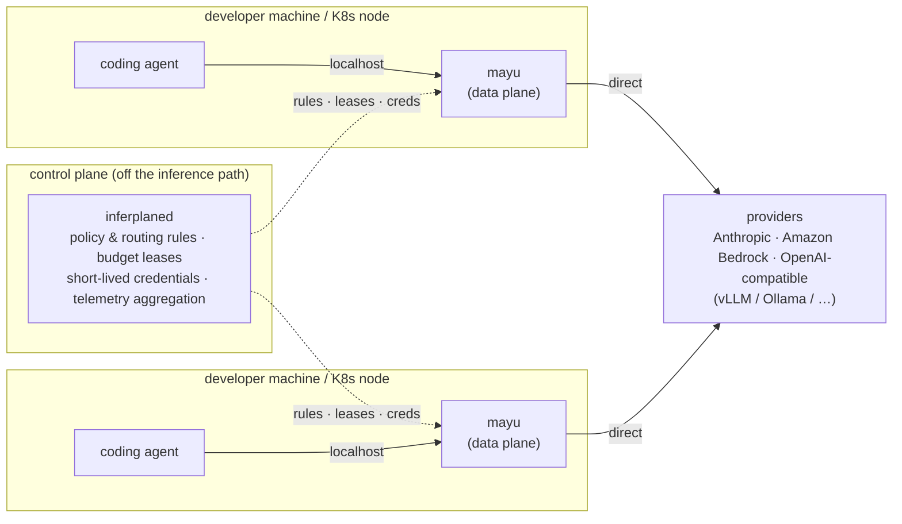

# inferplane

[](LICENSE)
[](go.mod)
[](#status)

**inferplane** — a control plane for LLM consumption governance.
Policy, budget, and credentials are distributed from the center; **`mayu`**, the
node-local data plane, enforces them without sitting in anyone's critical path.

`mayu` is a component name, not a project name — it holds the same position in
inferplane that ztunnel/waypoint hold in Istio. It runs on localhost or on each
Kubernetes node, speaks your coding agent's native protocol (Anthropic Messages,
OpenAI Chat Completions, Bedrock InvokeModel), and enforces the rules the control
plane (`inferplaned`) hands it: per-user attribution, budget cutoffs, model-tier
routing, cache-affinity, and OTel instrumentation.

## Why not a central gateway?

Every "LLM gateway" puts a shared hop on the inference path. inferplane exists
because that is the wrong place to stand:

1. **Streaming latency.** Agent traffic is server-sent events; a central hop
   taxes *every chunk* of *every response* and lands directly on time-to-first-
   token. This is measurable — benchmark a proxied vs. direct stream and the
   cost of the extra hop is visible on day one, before any queueing under load.
2. **Fault isolation.** When a central gateway degrades, every developer and
   every agent stops at once. A node-local data plane keeps enforcement running
   through a control-plane outage: rules and budget leases already on the node
   keep working (fail-open within lease validity; only hard budget caps fail
   closed when their lease expires — per-rule `failurePolicy`, never global).

The control plane never carries inference traffic. It distributes policy, issues
budget leases, brokers short-lived credentials, and aggregates telemetry — all
off the request path.

## Architecture



- **`inferplaned`** (control plane) — distributes versioned policy
  ([`api/v1alpha1`](api/v1alpha1/): CRD-style schema, delivered over
  inferplane's own gRPC/HTTP — no Kubernetes required), issues budget leases,
  brokers short-lived provider credentials via OIDC, and aggregates telemetry.
  *Currently a scaffold (health endpoints only).*
- **`mayu`** (data plane) — the full gateway: model→provider routing with
  fallback and circuit breakers, Anthropic⇄OpenAI schema translation,
  cache-safe verbatim forwarding, virtual keys with team RBAC, two-phase
  quota/budget enforcement, tamper-evident audit logging, Prometheus/OTel
  GenAI metrics. *Works standalone today* (see Quick start).

Budget control uses a **lease pattern**: N proxies each see only their own
usage, so the control plane grants each `mayu` a slice of budget ("this much,
for this interval") that it enforces locally with zero network round trips,
reporting consumption and renewing asynchronously.

## What it governs

- **Per-user token attribution** — who spent what, per user/team/model, at
  integer micro-USD precision; identity fixed at credential issuance (OIDC).
- **Budget enforcement** — two-phase (pre-check before billing, settle after),
  team and per-key budgets/quotas, `block` or `warn`, hard caps that stay hard
  even when the control plane is down.
- **Model-tier routing** — route by model to the right provider/region tier
  (e.g. Opus for design work, Haiku for hooks and summaries, batch for
  non-interactive), with priority fallback and per-provider circuit breakers.
- **Cache-affinity** — pin a session/prefix to the same region/inference
  profile so server-side prompt caches stay warm; the affinity-vs-fallback
  conflict is an explicit per-rule choice, because failing over cold-starts
  the server cache and can *raise* cost.
- **Credential lifetime** — long-lived provider keys never rest on developer
  machines; the control plane brokers short-lived credentials. (Standalone
  mode uses local config refs — see below.)
- **Audit** — a tamper-evident hash-chain of every request, with chargeback
  reporting (`mayu report`).

## Quick start — `mayu` standalone

`mayu` runs without a control plane: local config only, full gateway feature
set. This is the supported first-touch path — you do not need to deploy
`inferplaned` to try inferplane. (Standalone mode reads provider keys from
local `env:`/`file:` refs; in the control-plane topology, credentials are
brokered short-lived instead.)

```bash
git clone https://github.com/inferplane/inferplane.git
cd inferplane

# 1. Build the static binary (pure Go, CGO off)
CGO_ENABLED=0 go build -trimpath -o bin/mayu ./cmd/mayu

# 2. Run against the example config (Anthropic direct; secrets via env refs only)
export ANTHROPIC_API_KEY=sk-ant-...
export INFERPLANE_ADMIN_TOKEN=admin-secret
bin/mayu serve --config examples/config.json

# 3. Issue a virtual key (plaintext ik_... is shown once, never recoverable)
bin/mayu keys create --team demo --models '*' --store keys.db

# 4. Point your coding agent at it
export ANTHROPIC_BASE_URL=http://localhost:8080
export ANTHROPIC_API_KEY=ik_...
claude
```

Governance rules live in CRD-style `GovernancePolicy` YAML — the same
documents the control plane will distribute, applied locally today: add
`"policies": ["examples/policies/"]` to the config and edit the YAML
(per-team/per-user model allow-lists, budgets in milliUSD, rate limits — see
[`examples/policies/demo.yaml`](examples/policies/demo.yaml)). Files are
watched: **save a change and it applies within ~2 seconds**, no restart.

Port `8080` is the data plane; `9090` is the admin plane (`/healthz`,
`/metrics`, key-management API, and the web console at
`http://localhost:9090/admin/ui/`). For a self-hosted-only setup (vLLM/Ollama,
no cloud key) start from
[`examples/config.selfhosted.json`](examples/config.selfhosted.json); for
Docker and Kubernetes (Helm chart in [`charts/inferplane`](charts/inferplane/)),
config hot-reload, OIDC SSO, and `mayu login` short-lived keys, see
[docs/onboarding.md](docs/onboarding.md).

## Status

**Alpha. APIs and config schema are unstable and will change without notice.**

| Component | State |
|---|---|
| `mayu` standalone (gateway, keys, RBAC, quotas/budgets, audit, console) | Working — the former inferplane gateway, moved intact |
| `inferplaned` control plane | Scaffold (health endpoints only) |
| `api/v1alpha1` policy schema, budget leases, credential brokering | Schema landed; distribution not yet wired |

The project targets CNCF Sandbox. Design records live in
[docs/decisions/](docs/decisions/) (start with
[ADR-031](docs/decisions/ADR-031-monorepo-control-plane-data-plane-split.md),
the control-plane/data-plane split); architecture detail in
[docs/architecture.md](docs/architecture.md).

## Contributing

See [CONTRIBUTING.md](CONTRIBUTING.md). Every commit must be DCO signed off
(`git commit -s`). Security reports: [SECURITY.md](SECURITY.md).
License: [Apache-2.0](LICENSE).

---

<a id="korean"></a>

## 한국어 요약

**inferplane** — LLM 소비 거버넌스를 위한 control plane.
정책·예산·크레덴셜은 중앙에서 배포되고, 노드 로컬 data plane인 **`mayu`**가
누구의 critical path에도 끼어들지 않고 이를 집행합니다. `mayu`는 프로젝트명이
아니라 컴포넌트 이름입니다 (Istio의 ztunnel/waypoint와 같은 위치).

**왜 중앙 게이트웨이가 아닌가?**
(1) 스트리밍 지연 — 중앙 홉은 모든 SSE 청크에 붙어 TTFT에 직접 영향을 주며,
벤치마크로 즉시 증명됩니다. (2) 장애 격리 — 중앙 장애가 전체 개발자를 멈추지
않습니다. 노드에 이미 내려온 규칙과 예산 리스는 컨트롤 플레인 장애 중에도
동작합니다 (리스 유효기간 내 fail-open, hard budget cap만 리스 만료 시
fail-closed — 실패 정책은 규칙 단위).

**Quick start** — `mayu`는 컨트롤 플레인 없이 로컬 설정만으로 단독 실행되는
완전한 게이트웨이입니다. 위 [Quick start](#quick-start--mayu-standalone) 4단계
(빌드 → serve → 가상 키 발급 → `ANTHROPIC_BASE_URL` 지정)를 따르세요.

**상태** — 알파. API·설정 스키마는 예고 없이 변경됩니다. `mayu` 단독 모드는
기존 게이트웨이 전체 기능(가상 키, 팀 RBAC, 쿼터/예산, 변조 감지 감사, 콘솔)이
동작하며, `inferplaned`는 아직 스캐폴드입니다. 상세 설계는
[ADR-031](docs/decisions/ADR-031-monorepo-control-plane-data-plane-split.md)
참고. 취약점 제보는 [SECURITY.md](SECURITY.md), 라이선스는 Apache-2.0.
