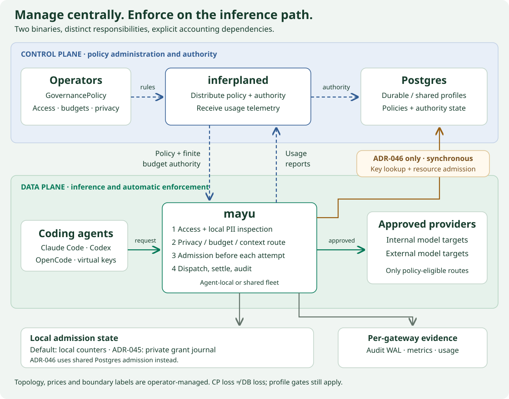
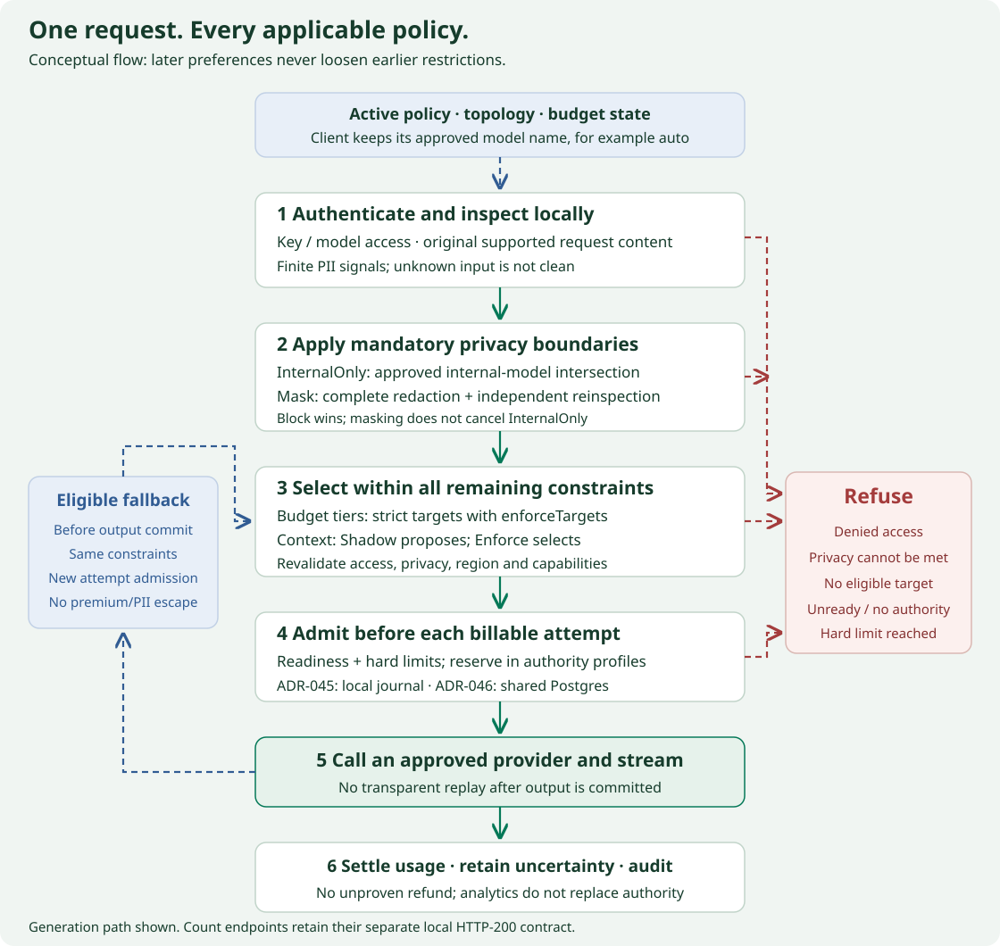

# 아키텍처 {#architecture}

## 시스템 개요 {#system-overview}

추론 트래픽과 정책 관리를 분리합니다. **mayu**는 요청을 인증·라우팅하고 제어를 집행하며 사용량을 기록합니다. **inferplaned**는 정책·예산 사용 권한을 배포하고 사용량을 집계하며 선택적으로 단기 Bedrock 자격 증명을 중개합니다. 두 바이너리는 정적 Go이며 독립 mayu는 제어 영역이 필요 없습니다.

[아키텍처 다이어그램 크게 보기](assets/architecture.svg)

**녹색 실선 화살표는 추론, 파란 점선 화살표는 정책·예산 권한·사용량 동기화 경로입니다. 황색 연결은 ADR-046 전용 동기 공유 DB 경로입니다.** 프롬프트와 응답 스트림은 에이전트 → mayu → 공급자 경로에 머뭅니다. 사용량 텔레메트리는 별도로 제어 영역에 전달됩니다.

요청마다 제어 영역 HTTP를 호출해 승인하지 않습니다. 의존성은 [프로파일](getting-started/deployment-profiles.md)에 따라 다릅니다. 로컬은 프로세스 카운터, ADR-045는 중앙에서 확정한 금전 권한과 비공개 로컬 저널, ADR-046은 Postgres 동기 키 조회·자원 예약을 사용합니다. 분리 구조만으로 무조건적인 가용성을 보장하지 않습니다.

## 설정이 자동 집행으로 이어지는 과정 {#how-configuration-becomes-automatic-enforcement}

운영자는 데이터 영역에 모델·공급자 토폴로지, 처리 경계, 기능, 가격, 참조 자격 증명을 선언합니다. `GovernancePolicy`는 대상에 매칭되는 모델 접근·요청률·할당량·예산·라우팅 규칙을 제공합니다. 게이트웨이는 감시하는 로컬 `policies` **또는** 연결된 `control_plane` 중 하나를 읽으며 둘을 함께 설정하면 거부합니다. 중앙 정책 배포가 공급자 토폴로지를 자동 배포하거나 내부 목적지를 검증하는 것은 아닙니다.

제어 영역을 연결하면 정책·예산 권한 동기화는 추론 요청 밖에서 실행됩니다. 게이트웨이는 첫 동기화, 정책 나이, 신원, 프로파일별 권한 조건에 따라 적용할 상태를 검증·설치합니다. 변경은 모든 게이트웨이에 원자적으로 반영되지 않고 비동기로 전파됩니다.

mayu는 생성 요청마다 설치된 정책, 현재 키 접근 권한, 요청 검사, 예산 상태를 조합합니다. 클라이언트가 전환을 일일이 선택하지 않아도 설정된 PII 동작·예산 전환·컨텍스트 선호가 라우팅 판단으로 이어집니다. 컨텍스트는 명시적으로 활성화하기 전까지 Shadow이며 개인정보·엄격 예산 목적지는 계속 집행됩니다. [설정과 자동 판단 예제](why-inferplane.md#one-configuration-several-automatic-decisions)를 참고하세요.

이 구조의 이점은 관리 수명 주기를 분리하면서 요청을 로컬에서 검사·집행한다는 점입니다. 저장소·자격 증명 의존성이 사라지는 것은 아닙니다. ADR-045는 CP·DB 장애 중 기존의 유효한 권한만 소비할 수 있고, ADR-046은 승인마다 접근 가능한 Postgres가 필요합니다. [프로파일별 장애 표](getting-started/deployment-profiles.md#understand-outages)는 생성이 계속되거나 거부되는 조건을 설명합니다.

## 구성 요소 {#components}

### 수신 계층 · internal/server {#ingress-layer-internalserver}

Messages, Chat Completions, Responses, Bedrock 형식 생성 경로는 신원·본문 크기·준비 상태·접근·거버넌스 제어를 공유합니다. 모델·사용량 조회에는 인증이 필요합니다. 계산 API는 생성 거부 상황에서도 로컬 추정과 HTTP 200 계약을 유지합니다. [HTTP 레퍼런스](api-reference.md)를 참고하세요.

별도 관리 리스너는 상태·메트릭·인증된 관리 API·데이터 없는 콘솔 셸을 제공합니다. OIDC·정적 토큰의 신원·권한 계약은 다르며 조직·팀 역할 6개의 전체 모델은 미완료입니다.

### 거버넌스 계층 · internal/governance, internal/authority {#governance-layer-internalgovernance-internalauthority}

| 프로파일 | 승인 상태 | 실패 경계 |
| --- | --- | --- |
| 로컬 SQLite·선택적 기존 CP | 로컬 요청률·할당량·금전과 기존 CP 허용량 | 재시작 시 로컬 카운터 초기화, 준비 상태·리스 조건은 적용 |
| 노드별 영속 금전 · ADR-045 | Postgres 정책 금전, 유한 권한, 비공개 저널 | 준비·정책 나이·하드 기한 내 기존 권한만 사용. CP·DB 장애 중 보충 불가 |
| 공유 Postgres · ADR-046 | 공유 키·팀 스냅샷, 원자적 요청률·토큰·금전 예약 | 새 키 조회·승인에 접근 가능한 Postgres와 유효 정책 바인딩 필요 |

과금되는 외부 호출 전에 집행합니다. 권한 프로파일은 **공급자 시도마다** 보수적 상한을 예약합니다. 알려진 사용량을 정산하고 환급을 증명할 수 없으면 불확실성을 유지합니다. 만료·노드 유실·스트림 중단으로 새 잔액이 생기지 않습니다. 금전은 정수 microUSD와 round-half-even을 사용합니다. 가격은 운영자가 검토하는 회계 입력이며 외부 청구서 보장이 아닙니다.

### 공급자 계층 · providers {#provider-layer-providers}

| 패키지 | 책임 |
| --- | --- |
| `anthropic` | Messages와 서버 자격 증명 주입 |
| `bedrock` | InvokeModel·Converse·Mantle 설정 경로, AWS 서명·API 한계 |
| `bedrockresponses` | AWS 자격 증명·서명을 결합한 네이티브 Bedrock Responses |
| `openaicompat` | Chat Completions 호환 업스트림 |
| `openairesponses` | 네이티브 Responses 업스트림 |

공급자 인터페이스가 확장 경계입니다. 호환 프로토콜의 원문 전달, 의도적 모델 치환, 선택적 마스킹, 교차 프로토콜 변환은 각각의 계약을 따릅니다. 기능 선언은 모든 도구·추론 지원의 증거가 아닙니다. 미지원 가드레일·API 조합은 우회하지 않고 거부합니다. [공급자 레퍼런스](reference/agent-llm.md)를 참고하세요.

### 라우팅 계층 · router, sensitivity, tier {#routing-layer-internalrouter-internalsensitivity-internaltier}

공개 모델 해석, 허용 목적지, 예산 티어, 민감 정보, 컨텍스트, 공급자 폴백을 조합합니다. 모든 시도가 접근·개인정보·리전·용량·엄격 목적지 조건을 지켜야 합니다. 기존 선택적 티어는 대안을 못 쓰면 원래 모델을 유지하지만 명시적 엄격 티어는 거부할 수 있습니다. Shadow도 개인정보를 집행합니다. 세션 안정성은 유한한 로컬 상태이며 공유 세션 권한이 아닙니다.

폴백은 수신·공급자의 출력 확정 전 스트리밍 경계 안에서만 가능합니다. 출력 확정 후 실패한 스트림을 투명하게 재실행할 수 없습니다. [정책 라우팅](policy-routing.md)·[적응형 라우팅](adaptive-routing.md)을 참고하세요.

### 영속 계층 · keystore, authority, audit {#persistence-layer-internalkeystore-internalauthority-internalaudit}

해시 키·팀의 기본 저장소는 SQLite입니다. 공유 프로파일은 Postgres 키·팀과 공유 자원 승인을 구현합니다. 선택적 사용자·서비스 신원은 영속 레지스트리를 사용하면서 등록된 회계 참조를 유지합니다. Postgres 선택만으로 활성화되지 않습니다.

정책·사용량·분석도 Postgres에 저장할 수 있습니다. 가변 공급자 토폴로지는 SQLite 전용이며 공유 거버넌스에서는 거부됩니다. ADR-045 비공개 저널과 인스턴스별 감사 WAL을 실행 중 게이트웨이끼리 공유하면 안 됩니다. [데이터](reference/data.md)와 [검증된 신원](verified-identity.md)을 참고하세요.

### 관측 계층 · internal/metrics {#observability-layer-internalmetrics}

관리 포트의 Prometheus가 제한된 `gen_ai_*`·`inferplane_*` 메트릭을 제공합니다. 선택적 트레이스는 OTLP를 사용합니다. 감사는 인스턴스 구간의 정확한 바이트 해시 체인과 선택적 외부 앵커를 사용합니다. 본문 수집은 별도 선택적 암호화 저장소이며 감사 체인이 아닙니다.

### 제어 영역 텔레메트리 · ADR-036 {#control-plane-telemetry-internaltelemetry-internalcontrolplane-adr-036}

사용량 윈도는 정책·권한 동기화와 별도로 `POST /v1alpha1/usage`에 전달됩니다. 분석·콘솔용이며 OTLP도 권한 원장의 대체물도 아닙니다. 분석 전달 손실과 미확정 금전 의무는 구분해야 합니다.

### 공통 보안 계층 {#security-layer-cross-cutting}

가상 키 해시, 업스트림 자격 증명 분리, 비밀 참조, 제한된 메트릭, 실패 시 거부로 설정된 경계를 보호합니다. 정책 관리·자격 증명 중개는 전용 자격 증명을 사용합니다. 침해된 호스트는 로컬 자격 증명·세션을 얻을 수 있습니다. 공급자 라벨·신원 지문은 호스트 증명이 아닙니다. [보안 경계](operations/security.md)를 참고하세요.

## mayu 내부의 요청별 판단 {#mayu-component-diagram}

[처리 흐름 다이어그램 크게 보기](assets/request-flow.svg)

여러 판단의 결합을 보여주는 그림이며 모든 수신 핸들러가 같은 함수를 이 순서로 실행한다는 뜻은 아닙니다. 접근·개인정보·기능·리전·활성 엄격 예산 제한은 모든 목적지에 적용됩니다. 컨텍스트와 캐시 선호는 그 허용 집합 안에서만 작동합니다.

`InternalOnly`는 허용된 내부 모델 집합의 교집합에 속한 모델과 호환되는 내부 경계의 공급자를 모두 요구합니다. `Mask`는 사용 가능한 체인을 반환하기 전에 완전 변환과 독립 재검사를 요구하며, 별도의 `InternalOnly` 의무를 해제하지 않습니다. `Block`이 우선합니다. 호환 목적지가 없으면 요청을 거부합니다.

`enforceTargets: true`에서는 활성 예산 티어가 시도를 지정 목적지로 제한합니다. 하드 한도 승인과 별도이며 새로운 예산 권한을 만들지 않습니다. 기존 선택적 치환은 대안이 불가능하면 원래 모델을 유지합니다. 권한 기반 시도는 허용된 재시도를 포함해 각각 상한을 예약합니다. 부분 스트림이나 증명되지 않은 비용이 환급을 만들지 않습니다.

## 요청 흐름 {#data-flow-summary}

1. 가상 키를 인증하고 현재 주체·신원을 확인합니다.
2. 요청을 파싱·제한하고 지원되는 전달·변환에 필요한 프로토콜 표현을 보존합니다.
3. 라우팅과 접근·개인정보·리전·기능 조건을 적용합니다.
4. 과금되는 시도마다 준비 상태·거버넌스를 검사하고 필요한 권한을 예약합니다.
5. 선택 프로토콜로 호출·스트리밍하며 종료 실패를 보존합니다.
6. 관측 사용량을 정산하고 미해결 의무를 유지하며 감사·관측 기록을 만듭니다.

개념적 순서이며 프로토콜별 처리는 해당 핸들러에 남습니다. 이후 폴백이 앞선 제한을 넓힐 수 없습니다.

## 인프라 {#infrastructure}

### 배포 {#deployment}

각 Dockerfile은 정적 바이너리를 비루트 distroless 이미지로 만듭니다. Helm은 설정과 기존 Secret을 참조합니다. 로컬은 복제본 하나, 명시적 공유 모드는 여러 게이트웨이를 지원합니다. 영속 공유 모드는 독립 감사 PVC·안티어피니티·중단 예산을 구성합니다. Postgres HA, TLS, 네트워크, 용량, 복구 검증은 운영자 책임입니다. [컨테이너·Helm](operations/deployment.md)을 참고하세요.

### 모듈과 리소스 {#modules-resources}

| 구성 | 경로 | 역할 |
| --- | --- | --- |
| 데이터 영역 | `cmd/mayu` | 얇은 조립 코드와 운영 CLI |
| 제어 영역 | `cmd/inferplaned` | 정책·권한·사용량·선택적 중개 조립 |
| 정책 스키마 | `internal/policy`, `api/v1alpha1`, `deploy/crd` | 공유 규칙과 버전 계약 |
| Helm | `charts/inferplane` | 프로파일별 게이트웨이 매니페스트 |
| 모니터링 | `deploy/grafana/inferplane.json` | 시작용 대시보드 |

### 엔드포인트 {#deployed-endpoints}

기본 데이터 포트는 8080, 관리 포트는 9090이며 외부 노출은 명시적으로 구성합니다. inferplaned 기본 포트는 7601입니다. [API](api-reference.md)·[인프라](reference/infrastructure.md)를 참고하세요.

SIGHUP은 지원되는 공급자·모델·가격 토폴로지를 원자적으로 다시 읽습니다. 리스너·백엔드·신원 선언·노드/저널·권한 모드 변경에는 재시작이 필요합니다. 재로드 실패 시 이전 유효 토폴로지를 유지합니다.

## 핵심 설계 결정 {#key-design-decisions}

- 프로파일별 권한이 회계·장애 동작을 정합니다.
- 호환 교차 프로토콜은 정규 변환, 동일 프로토콜은 지원되는 원문 의미를 유지합니다.
- 과금 호출 전에 승인하고 재시도마다 별도 의무를 가집니다.
- 미확정 사용량은 근거 있는 복구가 가능할 때까지 사용 불가로 남습니다.
- 감사 필드는 덧붙여 발전시켜 기존 바이트 검증을 유지합니다.
- 구현된 기능도 [운영 검증](operations/production-readiness.md) 전에는 알파입니다.

## 운영 {#operations}

[모니터링](operations/observability.md), [업그레이드·복구](operations/recovery.md), [보안](operations/security.md)에서 시작하세요. [ADR](decisions/)은 설계 이력, [구현 레퍼런스](reference/INDEX.md)는 패키지 세부 사항을 제공합니다.
